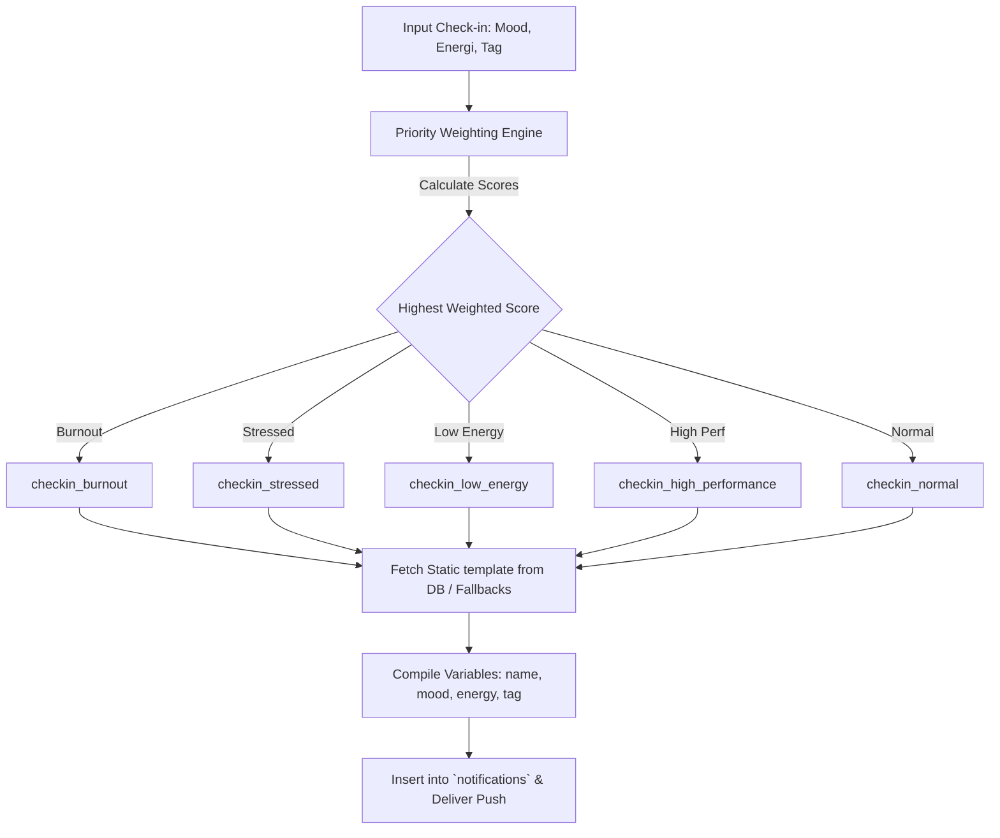

# 🐝 Bee Flow - Premium Zero-Cost Notification & Check-in System

Dokumentasi ini menjelaskan desain, arsitektur, dan implementasi dari sistem **Notification & Daily Check-In Template System** yang dirancang khusus untuk memangkas biaya token LLM hingga **100% (Zero-Cost)**, dengan kecepatan respons instan (<10ms) dan keandalan tinggi.

---

## 1. Analisis Arsitektur & Keuntungan Utama

Dalam codebase Bee Flow saat ini, data pengguna disinkronisasikan ke backend menggunakan **MySQL (melalui driver `mysql2` di `lib/turso.ts`)** dan state frontend diatur menggunakan `HPContext`. 

Men-generate pesan evaluasi wellbeing/mood harian menggunakan AI secara real-time memiliki kelemahan kritis:
1. **Biaya Token Tinggi**: Mengirimkan data mood, energi, dan logbook harian ribuan karyawan ke model LLM (seperti GPT atau Gemini) menghabiskan biaya operasional yang membengkak seiring waktu.
2. **Kependaman (Latency)**: Respon LLM memakan waktu 1–3 detik, merusak nuansa kelancaran gamifikasi platform yang dinamis.
3. **Risiko Ketidakpastian (Hallucination)**: LLM dapat menghasilkan pesan yang tidak terstruktur atau kurang pas secara empati.

### Solusi: Database Template Mapping dengan Weighting Prioritas
Sistem ini menggunakan algoritma berbasis **weighting (sistem bobot)** yang mengevaluasi input Mood, Energi, dan Kata Kunci secara deterministik dalam hitungan milidetik di sisi server, kemudian mengambil template pesan statis dari database.



---

## 2. Skema Database (SQL)

Tabel `notification_templates` telah diintegrasikan langsung ke dalam alur migrasi database (`/app/api/migrate-schema/route.ts`).

```sql
CREATE TABLE IF NOT EXISTS notification_templates (
    trigger_key VARCHAR(255) PRIMARY KEY,
    title_template VARCHAR(255) NOT NULL,
    message_template TEXT NOT NULL,
    type VARCHAR(50) DEFAULT 'info', -- 'info', 'success', 'warning', 'reminder', 'error'
    category VARCHAR(50) DEFAULT 'general', -- 'checkin', 'task', 'reminder', 'system'
    created_at DATETIME DEFAULT CURRENT_TIMESTAMP,
    updated_at DATETIME DEFAULT CURRENT_TIMESTAMP ON UPDATE CURRENT_TIMESTAMP
);
```

### Seeding Template Bawaan
Tabel ini secara otomatis diisi saat migrasi dijalankan, dengan template dinamis berikut:
* **`checkin_burnout`**: Ditrigger ketika indikasi kelelahan mental sangat tinggi.
* **`checkin_stressed`**: Ditrigger ketika stres kerja menonjol.
* **`checkin_low_energy`**: Ditrigger ketika energi sedang drop.
* **`checkin_high_performance`**: Ditrigger ketika produktivitas & mood membara.
* **`checkin_normal`**: Default check-in seimbang.
* **`task_approved` / `task_revision` / `task_rejected`**: Digunakan untuk feedback verifikasi tugas oleh manager.

---

## 3. Algoritma Weighting (TypeScript)

Algoritma weighting berjalan di `lib/notificationService.ts`. Mesin ini mengevaluasi 3 input pengguna dengan formula pembobotan prioritas (Priority Tie-breaker):

$$\text{Total Score} = \text{Mood Weight} + \text{Energy Weight} + \text{Keyword Tag Weight}$$

### Bobot Nilai (Weight Matrix)

| Input Parameter | Target Kategori | Bobot (+X) | Deskripsi |
| :--- | :--- | :--- | :--- |
| **Mood: Joy** | High Performance | +3 | Mood positif mendukung performa |
| **Mood: Calm** | Normal | +3 | Keadaan stabil |
| **Mood: Tired** | Low Energy | +3 | Kelelahan fisik |
| **Mood: Stressed** | Stressed / Burnout | +3 / +2 | Tekanan mental |
| **Energy: High** | High Performance | +3 | Kapasitas energi penuh |
| **Energy: Low** | Low Energy / Burnout | +3 / +2 | Kehabisan baterai |
| **Tag: "burnout"/"lelah"** | Burnout | +3 | Penegasan verbal langsung |
| **Tag: "stres"/"pusing"** | Stressed | +3 | Masalah beban kerja verbal |

### Kode Fungsi Utilitas Utama
Lihat di [lib/notificationService.ts](file:///c:/Users/Wahyudi/Documents/GitHub/happily/lib/notificationService.ts) bagian `calculateTriggerKey()` untuk logika lengkap pembobotan dan penyelesaian nilai seri (tie-breaker):
```typescript
// Priority order if scores tie: burnout > stressed > low_energy > high_performance > normal
```

---

## 4. Integrasi Titik Mutasi (Mutator Webhooks)

Sistem notifikasi template ini telah diintegrasikan langsung pada **3 endpoint mutasi utama**:

### A. Mood Check-In Mutator
* **Lokasi File**: [app/api/mood/checkin/route.ts](file:///c:/Users/Wahyudi/Documents/GitHub/happily/app/api/mood/checkin/route.ts)
* **Cara Kerja**: Saat karyawan melakukan evaluasi mood harian di modal check-in, endpoint menghitung `trigger_key` berbasis bobot, mencocokkannya ke template DB, lalu menaruh pesan terkompilasi ke dalam inbox notifikasi mereka secara instan.

### B. Task Verification Mutator (Task ACC)
* **Lokasi File**: [app/api/manager/verify-task/route.ts](file:///c:/Users/Wahyudi/Documents/GitHub/happily/app/api/manager/verify-task/route.ts)
* **Cara Kerja**: Ketika manager mengklik tombol **ACC** di dashboard tim, sistem otomatis mengambil info tugas, mencari nama manager, lalu mengirimkan notifikasi ke employee menggunakan template `task_approved`.

### C. Goal Status Mutator (Goal ACC, Revisi, Reject)
* **Lokasi File**: [app/api/goals/update/route.ts](file:///c:/Users/Wahyudi/Documents/GitHub/happily/app/api/goals/update/route.ts)
* **Cara Kerja**: Ketika manager melakukan aksi pada target OKR tim, status goal diupdate (`approved`, `revision`, `rejected`) dan otomatis mengirim notifikasi yang relevan dengan memanggil `dispatchNotification`.

---

## 5. Analisis Efisiensi Pengingat Waktu (Break Siang & Pulang)

Untuk pengingat waktu dinamis seperti **Break Siang** dan **Jam Pulang**, kami merekomendasikan **Pendekatan Client-Side Hybrid / Service Worker** daripada Server Cron-Jobs. Berikut analisis komparatifnya:

### Perbandingan Efisiensi

| Metrik Evaluasi | Server-Side Cron-Jobs (misal Vercel Crons) | Client-Side Checking / Service Worker (Rekomendasi) |
| :--- | :--- | :--- |
| **Biaya Server** | Tinggi (men-trigger serverless function secara berkala) | **$0 (Zero-Cost)**, semua berjalan di browser pengguna |
| **Ketepatan Waktu** | Kaku (dijalankan di jam tetap GMT, sulit disesuaikan per user) | **Sangat Akurat** (menggunakan local time perangkat user) |
| **Kustomisasi Jam** | Sulit (harus query DB satu-satu untuk tahu jam kerja user) | **Dinamis** (langsung membaca `state.workSchedule` dari memori) |
| **Keandalan** | Berjalan meskipun browser ditutup | Hanya berjalan saat tab aktif atau Service Worker teregistrasi |

### Rekomendasi Solusi: Client-Side Checking dengan Web Worker / React Hook
Karena Bee Flow adalah Single Page Application (SPA) yang sering dibuka di tab browser karyawan sepanjang hari kerja, pengecekan berbasis React Hook sangat efisien, ringan, dan **gratis**.

Berikut adalah komponen React Hook modular yang siap diintegrasikan di layout utama (`app/layout.tsx` atau komponen shell navbar):

```typescript
"use client";

import { useEffect, useRef } from "react";
import { useHP } from "@/lib/HPContext";

export function useTimeReminder() {
  const { state, notify } = useHP();
  const notifiedRefs = useRef<{ midday: boolean; checkout: boolean }>({
    midday: false,
    checkout: false,
  });

  useEffect(() => {
    if (!state?.workSchedule) return;

    // Run check every 1 minute
    const interval = setInterval(() => {
      const now = new Date();
      const currentHour = now.getHours().toString().padStart(2, '0');
      const currentMinute = now.getMinutes().toString().padStart(2, '0');
      const currentTime = `${currentHour}:${currentMinute}`;
      
      const { breakStart, end } = state.workSchedule;

      // 1. Check Lunch Break (Break Siang)
      if (currentTime === breakStart && !notifiedRefs.current.midday) {
        notify(
          "🍽️ Break Siang!", 
          `Sudah jam ${breakStart}. Yuk istirahat sejenak, regangkan otot, dan makan siang!`, 
          "info"
        );
        notifiedRefs.current.midday = true;
      }

      // 2. Check Work Hours End (Jam Pulang)
      if (currentTime === end && !notifiedRefs.current.checkout) {
        notify(
          "🌅 Jam Pulang! Evaluasi Harimu", 
          "Hari kerja hampir selesai. Jangan lupa lakukan checkout dan isi refleksi harian di logbook ya!", 
          "warning"
        );
        notifiedRefs.current.checkout = true;
      }

      // Reset flags at midnight
      if (currentTime === "00:00") {
        notifiedRefs.current = { midday: false, checkout: false };
      }
    }, 60000);

    return () => clearInterval(interval);
  }, [state?.workSchedule, notify]);
}
```

---

## 6. Cara Menggunakan template Secara Dinamis
Jika di masa depan Anda ingin menambahkan template kustom atau mengubah pesan, Anda hanya perlu:
1. Mengakses endpoint API `/api/notification-templates` menggunakan method **POST**.
2. Mengirimkan body berupa template baru:
   ```json
   {
     "triggerKey": "task_overload",
     "titleTemplate": "Kerja Cerdas, {name}! 🐝",
     "messageTemplate": "Wah, kamu punya {count} task hari ini. Ambil napas, prioritas nomor 1 dulu ya!",
     "type": "warning",
     "category": "task"
   }
   ```
3. Perubahan akan langsung diaplikasikan tanpa perlu men-deploy ulang kode Next.js!
