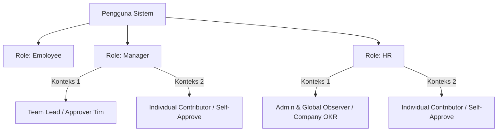
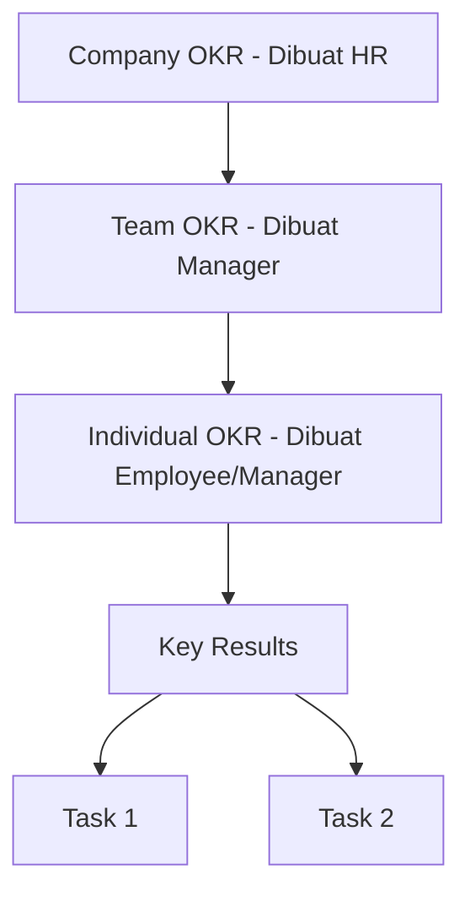
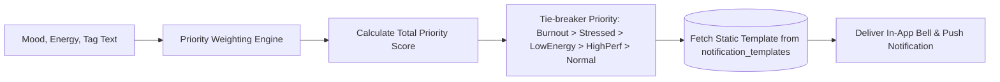

# PRODUCT REQUIREMENT DOCUMENT (PRD)
# Bee Flow 🐝 — Platform Manajemen Produktivitas, OKR, & Kesejahteraan Karyawan

---

## 1. DOKUMEN KONTROL & RINGKASAN EKSEKUTIF

| Parameter | Detail |
| :--- | :--- |
| **Nama Produk** | **Bee Flow** *(Internal Codename: Flowbee / Happily)* |
| **Versi PRD** | 2.0 (Final Comprehensive) |
| **Tanggal Terbit** | 27 Juli 2026 |
| **Status** | Approved for Production Development |
| **Pemilik Produk** | Product & Engineering Team |
| **Target Audience** | Enterprise & SMBs (Karyawan, Manajer, HR) |

### 1.1 Visi Produk
Membuat platform produktivitas kerja generasi baru yang menyelaraskan capaian strategis perusahaan (OKR) dengan pertumbuhan personal dan kesejahteraan (wellbeing) karyawan melalui pendekatan gamifikasi bermakna, otomatisasi berbasis AI yang efisien, dan budaya kerja yang transparan.

### 1.2 Masalah yang Diselesaikan
1. **Friction Antara Target & Kesejahteraan**: Karyawan sering mengalami *burnout* karena sistem manajemen kinerja berfokus secara kaku pada output tanpa memantau indikator kelelahan mental & mood harian.
2. **Biaya AI Operasional yang Membengkak**: Implementasi AI pada platform HRIS tradisional sering kali mahal karena pemanggilan LLM secara *real-time* tanpa strategi penghematan token.
3. **Ketidakjelasan Akuntabilitas & Approval Bottleneck**: Proses approval tugas sering tersendat saat tidak ada jenjang manajerial di atas Manajer/HR, atau ketika tugas mandiri terhambat verifikasi.
4. **Logbook Manual yang Menyita Waktu**: Karyawan menghabiskan waktu menulis laporan harian secara berulang alih-alih berfokus pada pekerjaan inti.

### 1.3 Nilai Tambah Utama (Value Proposition)
* **Gamifikasi Berbasis Performa & Persistence**: Pengumpulan XP, Rank E–S, dan pengakuan sosial (Kudos) yang mendorong motivasi intrinsik.
* **Sistem OKR & Task 3-Level dengan Self-Approve**: Alur tugas transparan dengan aturan akuntabilitas ketat (`reviewed` vs `self_approved`).
* **Sistem Notifikasi Zero-Cost**: Menggunakan *Priority Weighting Engine* deterministik (<10ms) untuk respons mood/wellbeing tanpa biaya token AI tambahan.
* **Strategi AI "Generate Once, Serve Many"**: Pemanggilan LLM secara *batch* mingguan (Jumat malam) untuk rangkuman otomatis dan saran motivasi, menghemat token hingga 95%+.
* **Automated Logbook Calendar**: Kalender aktivitas harian yang teragregasi secara otomatis tanpa perlu pengisian manual.

---

## 2. PENGGUNA & RBAC (ROLE-BASED ACCESS CONTROL)

Sistem dirancang secara ketat berbasis 3 Peran (*Role*). Setiap akun Manajer dan HR juga memiliki fungsi sebagai Karyawan (*Employee*) tanpa perlu membuat akun terpisah.



### 2.1 Matriks Peran & Hak Akses

| Fitur / Modul | Employee | Manager | HR |
| :--- | :---: | :---: | :---: |
| **Clock-in / Clock-out & Status Presensi** | ✅ (Milik sendiri) | ✅ (Milik sendiri) | ✅ (Milik sendiri) |
| **Lihat Presence Board (Semua Karyawan)** | ✅ | ✅ (Filter per tim/divisi) | ✅ (Filter global) |
| **Isi Mood & Energy Harian** | ✅ | ✅ | ✅ |
| **Input & Kerjakan Task Harian** | ✅ (Jalur Review) | ✅ (Self-Approve) | ✅ (Self-Approve) |
| **Kelola Company OKR** | ❌ (Read-only) | ❌ (Read-only) | ✅ (Full Access) |
| **Kelola Team OKR** | ❌ (Read-only) | ✅ (Divisi Sendiri) | ❌ (Read-only Global) |
| **Kelola Individual OKR / KPI Mandiri** | ✅ (Milik sendiri) | ✅ (Milik sendiri) | ✅ (Milik sendiri) |
| **Approve / Revisi / Tolak Task Karyawan** | ❌ | ✅ (Tim Divisi) | ❌ (Read-only Observer) |
| **Kirim Kudos (Peer Recognition)** | ✅ | ✅ (+20 XP) | ✅ |
| **Manajemen Survey Perusahaan** | ❌ (Pengisi) | ❌ (Pengisi) | ✅ (Pembuat & Analitik) |
| **Akses Log Presensi Permanen (Audit Log)** | ❌ | ❌ | ✅ (Export CSV/Excel) |
| **GROW Coaching 1-on-1 dengan AI** | ❌ (Peserta) | ✅ (Fasilitator) | ❌ (Read-only Summary) |
| **HR Internal Notes (Catatan Privat)** | ❌ | ❌ | ✅ (Hanya HR) |

---

## 3. SPESIFIKASI FITUR FUNGSIONAL

### 3.1 Fitur 1: Gamifikasi & Sistem Leveling (XP & Rank)

#### A. Sumber Perolehan XP

| Aktivitas Pengguna | Poin (XP) | Aturan & Ketentuan |
| :--- | :---: | :--- |
| **Clock-in Tepat Waktu** (Sebelum 08:00) | **+10 XP** | Terlambat 1–15 menit = +5 XP, >15 menit = 0 XP |
| **Clock-out Hadir Penuh** | **+5 XP** | Diberikan saat clock-out manual |
| **Task Disetujui Manager** | **+15 XP** | XP cair SETELAH status `Done (Accepted)` |
| **Task Direvisi Lalu Disetujui** | **+8 XP** | XP untuk task yang sempat mengalami revisi |
| **Isi Mood & Energy Check-in** | **+5 XP** | Maksimal 1 kali per hari |
| **Menerima Kudos dari Manager** | **+20 XP** | Diberikan langsung saat Kudos dikirim |
| **Isi Survey HR** | **+5 XP** | Per survey yang diselesaikan |
| **Streak 5 Hari Kerja Aktif** | **+25 XP** *(Bonus)* | 5 hari kerja berturut-turut |
| **Streak 1 Bulan Penuh** | **+200 XP** *(Bonus)* | Dihitung dari seluruh hari kerja kalender (21–23 hari) |
| **KPI Bulanan Tercapai (Verified)** | **+150 XP** *(Bonus)* | Diberikan saat Manager menutup KPI di akhir bulan |
| **KPI Bulanan Melampaui Target** | **+250 XP** *(Bonus)* | Untuk pencapaian di atas 100% metrik kuantitatif |

#### B. Anti-Abuse & Penalty Rules
1. **Aturan Deskripsi Minimal**: Task hanya valid menambah XP jika memiliki deskripsi minimal **20 karakter** dan terhubung ke KPI (Manager atau KPI Mandiri).
2. **Cap Poin Harian**: Maksimal XP harian dari task adalah **75 XP** (≈ 5 task disetujui).
3. **Aturan Penalti Inaktivitas**: Karyawan tidak aktif 3 hari kerja berturut-turut dipotong **-15 XP/hari** mulai hari ke-4, dan streak direset ke 0.
4. **Excused Absence**: Izin Sakit dengan keterangan resmi / surat dokter tidak memotong streak (*flagged as excused*).

#### C. Rumus Kenaikan Level & Rank

$$\text{Rank Tier} = f(\text{Level})$$

```
Level 1 :     0 –   499 XP  → Rank E  ("Rookie")
Level 2 :   500 – 1.499 XP  → Rank D  ("Contributor")
Level 3 : 1.500 – 3.499 XP  → Rank C  ("Performer")
Level 4 : 3.500 – 6.999 XP  → Rank B  ("Achiever")
Level 5 : 7.000 – 12.499 XP → Rank A  ("Leader")
Level 6 : 12.500 – 19.999 XP→ Rank S  ("Champion")
Level 7 : 20.000+ XP        → Rank S+ ("Legend")
```

---

### 3.2 Fitur 2: Hierarki OKR & Task Management System

#### A. Stuktur Hierarki 3-Level
1. **Company OKR**: Dibuat oleh HR, berlaku global per periode (misal: `2026-Q3`), menjadi acuan seluruh organisasi.
2. **Team OKR**: Dibuat oleh Manager per divisi (`division_id`), di-link sebagai turunan dari Company OKR.
3. **Individual OKR**: Dibuat oleh masing-masing individu (Employee/Manager/HR), di-link ke Team OKR atau berdiri sebagai **KPI Mandiri**.



#### B. Siklus Status Task & Approval Workflow

```
[Employee Task] : To Do ──> In Progress ──> Review (Submitted) ──┬──> Done (Accepted) [+15 XP]
                                                                 └──> Revise ──> In Progress

[Manager/HR Self-Approve Task] : To Do ──> In Progress ──> Done (Self-Approved otomatis)
```

* **Standard Review Workflow (Employee)**:
  1. Employee mengubah status task ke `Review` (Submit for Review).
  2. Manager melakukan **Accept** (`approval_type = reviewed`, `approved_by = manager_id`) $\rightarrow$ XP bertambah.
  3. Atau Manager melakukan **Revise** (wajib menyertakan `revision_note`) $\rightarrow$ Task kembali ke `In Progress`.
  4. Atau Manager melakukan **Reject** (wajib alasan) $\rightarrow$ Task ditolak, 0 XP.

* **Self-Approve Workflow (Manager & HR)**:
  * Ketika Manager atau HR mengerjakan Task pada Individual OKR miliknya sendiri dan menandainya `Done`:
  * Sistem secara otomatis mencatat `approval_type = self_approved`, `approved_by = user_id`, dan `approved_at = CURRENT_TIMESTAMP`.

* **Metrik Quality Score Bulanan**:
  $$\text{Quality Score} = \left( \frac{\text{Task Approved}}{\text{Task Submitted}} \right) \times 100\%$$
  * *Syarat Klaim Reward Bulanan*: Quality Score $\ge 70\%$ DAN memiliki minimal 1 KPI yang diverifikasi Manager.

---

### 3.3 Fitur 3: Presensi (Presence Board) & Kehadiran

#### A. Presence Board (Real-Time Status Board)
Halaman transparan yang dapat diakses seluruh role untuk melihat status kerja tim secara langsung.

* **Daftar Status Presensi**:
  * 🟢 `Working`: Aktif bekerja (Default saat Clock-in).
  * 🔵 `In Meeting`: Sedang dalam rapat.
  * 🟣 `Deep Focus`: Mode fokus penuh, notifikasi non-esensial ditunda.
  * 🟡 `On Break`: Istirahat sejenak.
  * 🟠 `Away`: Sedang tidak di meja kerja.
  * 🔴 `Sakit`: Izin sakit (wajib isi keterangan & opsional upload surat dokter).
  * ⚫ `Off Today`: Cuti tahunan / libur resmi / WFH Full.

#### B. Jam Kerja & Alur Clock-In / Clock-Out
* **Jam Kerja Standar**: Pukul **08:00 WIB**.
* **Clock-in Flow**:
  * Pilih Mode Kerja: WFO / WFH.
  * Masukkan Rencana Tugas Hari Ini (opsional, maks 100 karakter).
  * Tag lokasi GPS opsional untuk koordinat WFO.
* **Clock-out Flow**:
  * Menampilkan *Summary Auto-Report* (Task selesai, XP didapat, Mood status).
  * Prompt pemindahan task belum selesai ke hari berikutnya.
  * Input Rating Produktivitas Harian (1–5 Bintang).
  * *Auto Clock-out*: Jika belum clock-out hingga 23:59, sistem melakukan auto clock-out dengan *flag* khusus tanpa memberikan XP clock-out.

---

### 3.4 Fitur 4: Logbook Otomatis & Kalender Aktivitas

Logbook di Bee Flow **bukan merupakan formulir yang diisi manual**, melainkan kalender otomatis yang mengagregasi seluruh aktivitas digital karyawan.

```
┌──────────────────────────────────────────────────────────────────┐
│ KALENDER LOGBOOK HARI INI (Selasa, 27 Juli 2026)                 │
├──────────────────────────────────────────────────────────────────┤
│ Presensi : WFO | Clock-in: 07:55 | Clock-out: 17:30              │
│ Status   : 🟢 Working                                            │
├──────────────────────────────────────────────────────────────────┤
│ TASK ACTIVITY LOG                                                │
│ • [APPROVED] Implementasi Auth API Next.js 16 (+15 XP)           │
│ • [APPROVED] Fixing CSS Token Theme Variables (+15 XP)           │
│ • [REVISE]   Refactor Database Schema (Note: Tambah index)       │
├──────────────────────────────────────────────────────────────────┤
│ WELLBEING & XP SUMMARY                                           │
│ Mood: 😊 Joy (5/5) | Energy: ⚡ High | Total XP Hari Ini: +45 XP │
└──────────────────────────────────────────────────────────────────┘
```

* **Tampilan Kalender Bulanan**:
  * Warna indikator per tanggal (Abu-abu: Libur/Kosong, Hijau: Hadir & Produktif, Merah: Flag Auto-clockout/Absen, Biru: Izin Sakit Resmi).
* **Ringkasan Mingguan AI (Jumat Malam)**: Rangkuman otomatis yang diproses oleh cron job AI mingguan dan ditampilkan di bagian bawah kalender mingguan.

---

### 3.5 Fitur 5: Zero-Cost Notification & Priority Weighting Engine

Sistem notifikasi wellbeing dan evaluasi mood dirancang **100% Zero-Cost** (tanpa biaya pemanggilan AI real-time) dengan waktu respons instant (<10ms).

#### A. Arsitektur Weighting Engine

$$\text{Total Priority Score} = \text{Mood Weight} + \text{Energy Weight} + \text{Tag Keyword Weight}$$



#### B. Matriks Bobot (Priority Weight Matrix)

| Parameter Input | Kategori Target | Bobot (+X) | Trigger Key Terkait |
| :--- | :--- | :---: | :--- |
| **Mood: Stressed** | Stressed / Burnout | **+3** | `checkin_stressed` |
| **Mood: Tired** | Low Energy | **+3** | `checkin_low_energy` |
| **Mood: Joy** | High Performance | **+3** | `checkin_high_performance` |
| **Mood: Calm** | Normal | **+3** | `checkin_normal` |
| **Energy: Low** | Low Energy / Burnout | **+3** | `checkin_low_energy` / `checkin_burnout` |
| **Energy: High** | High Performance | **+3** | `checkin_high_performance` |
| **Tag: "burnout" / "lelah"** | Burnout | **+3** | `checkin_burnout` |
| **Tag: "stres" / "pusing"** | Stressed | **+3** | `checkin_stressed` |

---

### 3.6 Fitur 6: Asisten AI & Sesi GROW Coaching 1-on-1

* **Sesi Coaching GROW**:
  * Modul interaktif berbasis model coaching **GROW** (*Goal, Reality, Options, Will*).
  * Manajer menggunakannya sebagai panduan saat sesi 1-on-1 dengan karyawan.
  * Hasil dan rencana aksi tersimpan di profil karyawan.
* **Weekly AI Reflection Job (Jumat Malam)**:
  * Mengumpulkan data 1 minggu (Task, Mood, XP, Attendance).
  * Memanggil AI secara batch **1x per user per minggu**.
  * Menyimpan hasil ke database `ai_weekly_summaries` untuk digunakan sepanjang minggu berikutnya tanpa pemanggilan AI ulang.

---

### 3.7 Fitur 7: Modul HR, Management Survey, & Power BI Integration

* **Survey Management**:
  * Pembuat survey dinamis (Tipe: Yes/No, Multiple Choice, Rating 1–5, Text, Ranking).
  * Target penayangan: Seluruh Perusahaan, Departemen Tertentu, atau Individu.
  * Analitik hasil secara visual + export data CSV/PDF.
* **Audit Presensi Permanen**: Log audit presensi tersimpan permanen untuk kebutuhan payroll dan compliance HRIS.
* **Integrasi Power BI**: Endpoint API teraman untuk mengekspor agregasi dataset OKR, Performa, & Wellbeing ke Power BI Dashboard secara berkala.

---

### 3.8 Fitur 8: Sistem Komunikasi Tim (Real-Time Chat)

* **Saluran Komunikasi**:
  * Direct Message (1-on-1).
  * Channel Tim / Divisi (Otomatis berdasarkan `division_id`).
  * Cross-Divisional Announcement (Khusus Manager & HR).
  * Channel Khusus Internal HR (`hr-only`).
* **Fitur Chat**: Berkirim teks, emoji, lampiran file (maks 10 MB), reply thread, mention, dan pin pesan.

---

## 4. SPESIFIKASI ARSITEKTUR TEKNIS & SKEMA DATABASE

### 4.1 Tech Stack
* **Framework**: Next.js 16 (App Router)
* **UI Library**: React 19
* **Language**: TypeScript (Strict Mode)
* **Styling**: Vanilla CSS dengan Design Token System kustom (`app/globals.css`, `lib/constants.ts`)
* **State Management**: React Context API (`HPContext.tsx`)
* **Database & Driver**: MySQL / Turso DB via `mysql2` driver (`lib/turso.ts`)
* **Iconography**: Custom `HPGlyph` SVG system

---

### 4.2 Skema Database Relasional (SQL Schema)

```sql
-- 1. TABEL DEPARTEMEN / DIVISI
CREATE TABLE IF NOT EXISTS divisions (
    id VARCHAR(255) PRIMARY KEY,
    name VARCHAR(255) NOT NULL,
    manager_id VARCHAR(255),
    created_at DATETIME DEFAULT CURRENT_TIMESTAMP,
    updated_at DATETIME DEFAULT CURRENT_TIMESTAMP ON UPDATE CURRENT_TIMESTAMP
);

-- 2. TABEL PENGGUNA (USERS)
CREATE TABLE IF NOT EXISTS users (
    id VARCHAR(255) PRIMARY KEY,
    name VARCHAR(255) NOT NULL,
    email VARCHAR(255) UNIQUE NOT NULL,
    password VARCHAR(255) NOT NULL,
    role ENUM('hr', 'manager', 'employee') NOT NULL DEFAULT 'employee',
    division_id VARCHAR(255),
    level INT DEFAULT 1,
    xp INT DEFAULT 0,
    streak_count INT DEFAULT 0,
    avatar_url TEXT,
    created_at DATETIME DEFAULT CURRENT_TIMESTAMP,
    FOREIGN KEY (division_id) REFERENCES divisions(id) ON DELETE SET NULL
);

-- 3. TABEL OKR
CREATE TABLE IF NOT EXISTS okrs (
    id VARCHAR(255) PRIMARY KEY,
    type ENUM('company', 'team', 'individual') NOT NULL,
    owner_id VARCHAR(255), -- NULL jika type = 'company'
    division_id VARCHAR(255),
    parent_okr_id VARCHAR(255),
    period VARCHAR(50) NOT NULL, -- Contoh: "2026-Q3"
    objective_title TEXT NOT NULL,
    created_by VARCHAR(255) NOT NULL,
    created_at DATETIME DEFAULT CURRENT_TIMESTAMP,
    FOREIGN KEY (owner_id) REFERENCES users(id) ON DELETE CASCADE,
    FOREIGN KEY (division_id) REFERENCES divisions(id) ON DELETE SET NULL
);

-- 4. TABEL KEY RESULTS
CREATE TABLE IF NOT EXISTS key_results (
    id VARCHAR(255) PRIMARY KEY,
    okr_id VARCHAR(255) NOT NULL,
    title TEXT NOT NULL,
    target_value DOUBLE NOT NULL DEFAULT 100,
    current_value DOUBLE NOT NULL DEFAULT 0,
    unit VARCHAR(50) DEFAULT '%',
    created_at DATETIME DEFAULT CURRENT_TIMESTAMP,
    FOREIGN KEY (okr_id) REFERENCES okrs(id) ON DELETE CASCADE
);

-- 5. TABEL TASKS
CREATE TABLE IF NOT EXISTS tasks (
    id VARCHAR(255) PRIMARY KEY,
    key_result_id VARCHAR(255),
    assignee_id VARCHAR(255) NOT NULL,
    created_by VARCHAR(255) NOT NULL,
    title VARCHAR(255) NOT NULL,
    description TEXT,
    status ENUM('todo', 'in_progress', 'review', 'done') DEFAULT 'todo',
    approval_type ENUM('reviewed', 'self_approved'),
    approved_by VARCHAR(255),
    approved_at DATETIME,
    revision_note TEXT,
    due_date DATETIME,
    created_at DATETIME DEFAULT CURRENT_TIMESTAMP,
    FOREIGN KEY (key_result_id) REFERENCES key_results(id) ON DELETE SET NULL,
    FOREIGN KEY (assignee_id) REFERENCES users(id) ON DELETE CASCADE
);

-- 6. TABEL PRESENSI (ATTENDANCE LOGS)
CREATE TABLE IF NOT EXISTS attendance_logs (
    id VARCHAR(255) PRIMARY KEY,
    user_id VARCHAR(255) NOT NULL,
    work_mode ENUM('wfo', 'wfh') DEFAULT 'wfo',
    clock_in DATETIME NOT NULL,
    clock_out DATETIME,
    status_flag VARCHAR(50), -- 'on_time', 'late', 'auto_clockout', 'excused'
    notes TEXT,
    absence_reason TEXT,
    doctor_note_url TEXT,
    created_at DATETIME DEFAULT CURRENT_TIMESTAMP,
    FOREIGN KEY (user_id) REFERENCES users(id) ON DELETE CASCADE
);

-- 7. TABEL TEMPLATE NOTIFIKASI (ZERO-COST ENGINE)
CREATE TABLE IF NOT EXISTS notification_templates (
    trigger_key VARCHAR(255) PRIMARY KEY,
    title_template VARCHAR(255) NOT NULL,
    message_template TEXT NOT NULL,
    type VARCHAR(50) DEFAULT 'info',
    category VARCHAR(50) DEFAULT 'general',
    created_at DATETIME DEFAULT CURRENT_TIMESTAMP
);

-- 8. TABEL AI WEEKLY SUMMARIES (BATCHED OUTPUT)
CREATE TABLE IF NOT EXISTS ai_weekly_summaries (
    id VARCHAR(255) PRIMARY KEY,
    user_id VARCHAR(255) NOT NULL,
    week_code VARCHAR(20) NOT NULL, -- Contoh: "2026-W30"
    summary_paragraph TEXT NOT NULL,
    monday_motivation TEXT NOT NULL,
    growth_advice TEXT NOT NULL,
    created_at DATETIME DEFAULT CURRENT_TIMESTAMP,
    FOREIGN KEY (user_id) REFERENCES users(id) ON DELETE CASCADE
);
```

---

## 5. STRATEGI OPTIMASI BIAYA AI (TOKEN OPTIMIZATION)

Untuk memastikan keberlanjutan biaya operasional, Bee Flow menerapkan arsitektur **"Generate Once, Serve Many"**:

```
[CRON JOB - JUMAT MALAM] 
  │
  ├── 1. Kumpulkan Data Mingguan (Task, Attendance, Mood, XP) dari DB
  ├── 2. Panggil LLM API 1x per Karyawan (Single Prompt Batching)
  └── 3. Simpan Output ke Tabel `ai_weekly_summaries`
  
[HARI-HARI KERJA (SENIN - JUMAT)]
  │
  ├── Dashboard Logbook   ──> Ambil Rangkuman dari DB (0 Token)
  ├── Motivasi Pagi Senin  ──> Ambil Pesan dari DB (0 Token)
  └── Notifikasi Harian   ──> Diproses Priority Weighting Engine (0 Token)
```

### Hemat Biaya Token hingga 95%+
* **Tanpa AI Real-time Harian**: Evaluasi mood/energy harian diproses oleh *Priority Weighting Engine* deterministik tanpa menyentuh API LLM.
* **Satu Kali Pemanggilan Per Minggu**: AI hanya dipanggil satu kali per user per minggu pada Jumat malam, sehingga biaya token bersifat dapat diprediksi (*predictable fixed operational cost*).

---

## 6. BUSINESS RULES & ATTRIBUTION LAWS

1. **Scoping Divisi untuk Manager**: Query data tim untuk role Manager wajib memiliki klausa `WHERE division_id = current_user.division_id`.
2. **Read-Only Scoping untuk HR**: Akses HR ke Task/OKR divisi lain bersifat *Read-Only Observer*. HR tidak dapat melakukan approval terhadap task karyawan di divisi lain.
3. **Akuntabilitas Self-Approve**: Setiap task yang diselesaikan melalui self-approve oleh Manager/HR wajib menyertakan flag `approval_type = 'self_approved'` agar dapat dibedakan dalam audit laporan HR.
4. **Validasi Panjang Deskripsi Task**: Form task wajib memvalidasi deskripsi minimal 20 karakter sebelum diizinkan submit.

---

## 7. KRITERIA VERIFIKASI & METRIK KEBERHASILAN (KPI)

### 7.1 Automated Testing Coverage
* **Unit Test Requirement**:
  * Verification bahwa Employee **tidak bisa** mengubah status task ke `Done` secara langsung.
  * Verification bahwa Manager/HR self-approve secara otomatis mengisi `approval_type = 'self_approved'`.
  * Verification bahwa *Priority Weighting Engine* mengembalikan `trigger_key` yang tepat dalam <10ms.
  * Verification bahwa penalti XP dan reset streak berjalan sesuai jadwal inaktivitas 3 hari.

### 7.2 Target Performa Sistem
* **API Latency Check-in**: $< 50\text{ ms}$
* **Priority Weighting Response**: $< 10\text{ ms}$
* **Daily Active User (DAU) Engagement Rate**: $\ge 85\%$
* **Task Approval Cycle Time**: $< 24\text{ jam}$

---

*Dokumentasi PRD ini disahkan untuk platform Bee Flow (Flowbee) — Versi 2.0 (Juli 2026).*
